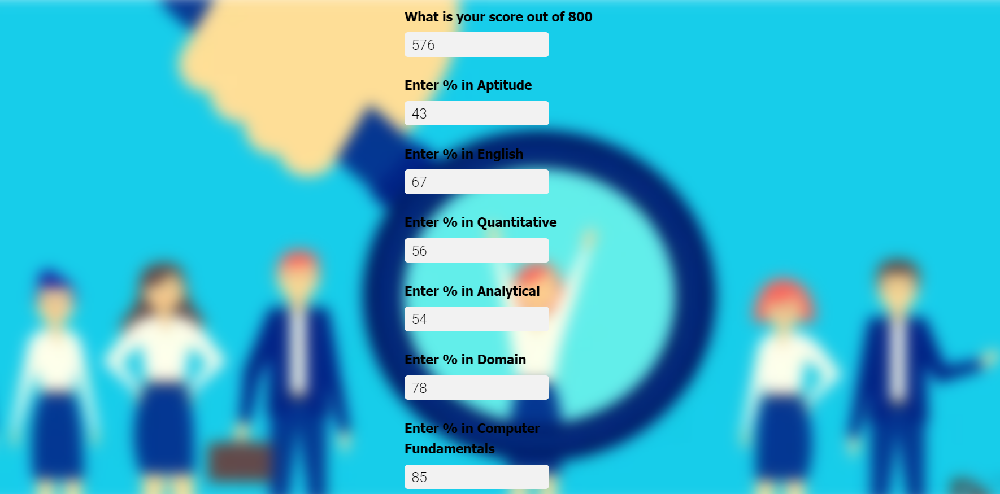
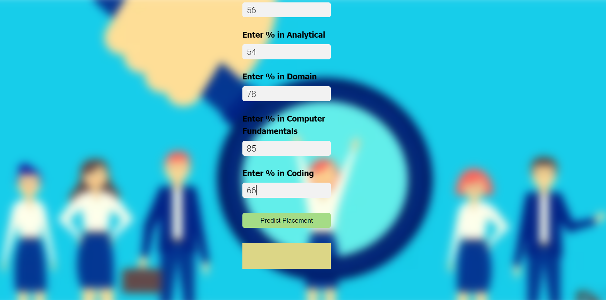
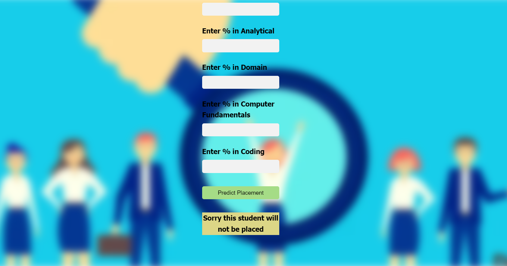

# Placement Prediction 

This machine learning project  can predict probable placement status of a student. 
Firstly, I built a model using **sklearn** and **logistic regression** using a placement dataset.
Secondly, it uses a **python flask** server to serve http requests. 
Finally,the website is built in html and css that allows user to enter placement data like score, precentages which calls the
flask server to retrieve the predicted placement status.
- Tools used:
    - Python                   - sklearn for model building
    - Python flask for server  - HTML,CSS for UI
    - IDE - Jupyter Notebook, Pycharm
- This repository is used to deploy a **machine learning web app** created with **Flask** on **Heroku** platform.
    Deployment Link: https://placement-predictor-jb.herokuapp.com/

## Glimpse of the web app:
1) Landing Page:
  
2) Different Outputs:
  

